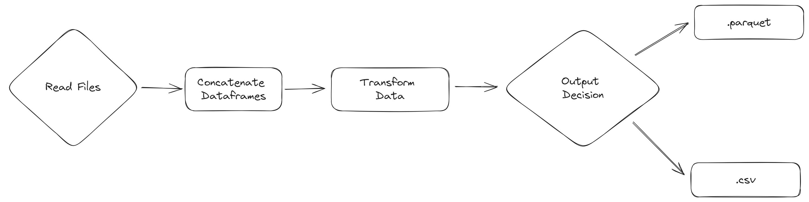

# Day 08 - Functions in Python - ETL with Pandas, JSON and Parquet

The objective is to create a simple ETL (Extract, Transform and Load) using python and pandas package. We will use the following steps:

- **Extract**: Reads data from a JSON file.
- **Transform**: Concatenate extracted data in a single Dataframe and calculate a new columns.
- **Load**: Save the final DataFrame in CSV or PARQUET file. 

#### Notes
- Tools for data quality:
    - [Pydantic](https://docs.pydantic.dev/latest/): Row by row or API.
    - [Pandera](https://pandera.readthedocs.io/en/stable/): Pandas or SQL.
- [`glob`](https://docs.python.org/3/library/glob.html) and [`os`](https://docs.python.org/3/library/os.html) packages.
- Test code inside `if __main__ == '__name__'`.

--------------
[Class repository](https://github.com/lvgalvao/data-engineering-roadmap/tree/main/bootcamp/aula08)
